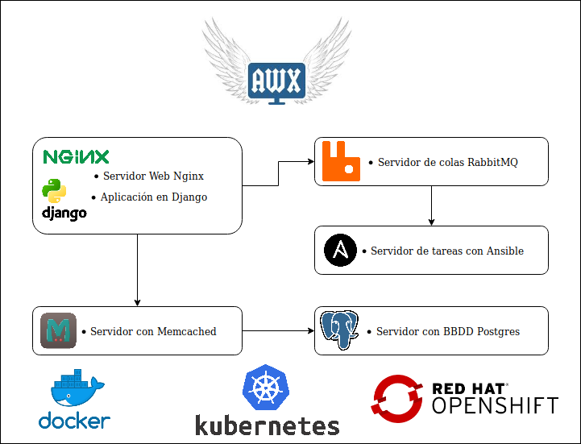
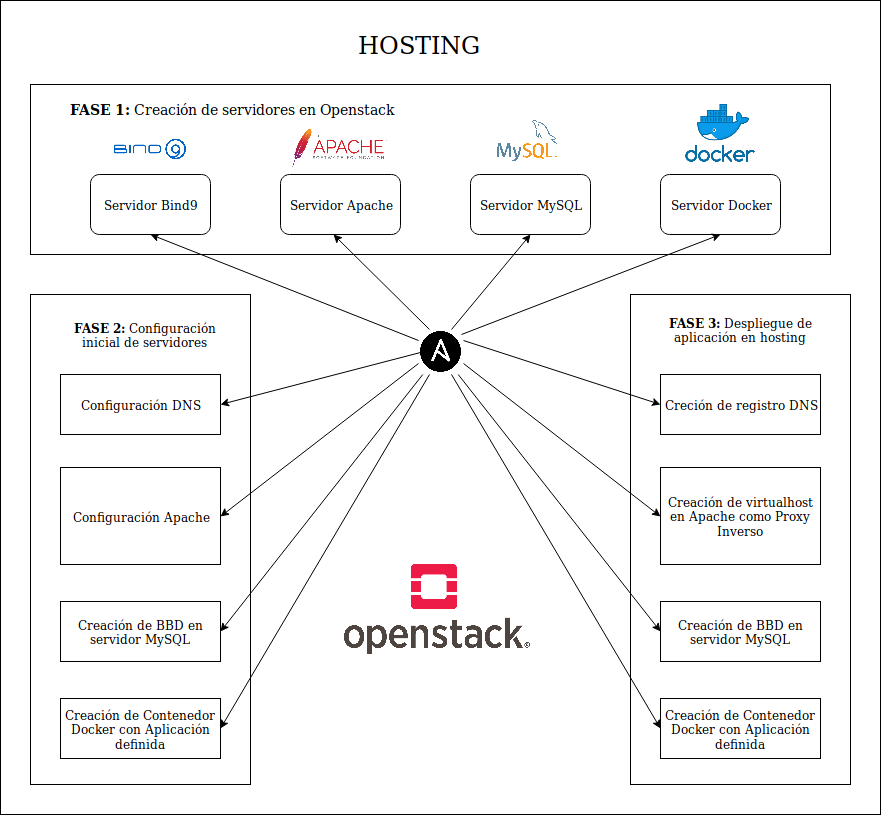

<section>
	<h2>Proyecto de Gestión y configuración de software con AWX e implementación Hosting</h2>
	<h3>Proyecto 2ASIR 2019</h3>
		<small>
		<a href="https://jpcarmona.github.io/web/">Juan pedro Carmona Romero</a>
		</small>
	

		
	

	
<small>Theme by: <a href="http://lab.hakim.se/reveal-js/#/">reveal.js</a></small>

</section>

<section>

  <section>
  <h2>AWX</h2>
  <ul>
   <li>¿ Qué es AWX ?</li>
   <li>Componentes de AWX</li>
   <li>Instalación</li>
   <li>Gestión de proyectos de automatización de tareas</li>
  </ul>
  </section>

  <section>
  <h2>¿ Qué es AWX ?</h2>
  

AWX es un proyecto de comunidad de código abierto, patrocinado por Red Hat, que permite a los usuarios controlar mejor el uso de sus proyecto de Ansible en entornos de TI. Deriva del proyecto anterior que se ofertaba como Red Hat Ansible Tower.
  

  </section>

  <section>
  <h2>Componentes de AWX</h2>
  
  </section>

  <section>
    <h2>Instalación</h2>
    <ul>
      <li>Mediante repositorio oficial AWX (Ejecución de Ansible)
        <ul>
          <li></li>
          <li>Editamos variables en inventory</li>
          <li>Ejecutamos playbook de Ansible</li>
        </ul>
      </li>
      <li>Mediante mi propio repositorio (Ejecución docker-compose)
        <ul>
          <li></li>
          <li>Editamos variables docker-compose</li>
          <li>Ejecutamos docker-compose</li>
        </ul>
      </li>
      <li>Métodos de instalación
        <ul>
          <li>Openshift</li>
          <li>Kubernetes</li>
          <li>En local con Docker</li>
        </ul>
      </li>
    </ul>
  </section>

  <section>
  <h2>Géstión de proyectos de automatización de tareas</h2>
  

    
  

  </section>

</section>

<section>

  <section>
  <h2>Despliegue de Hosting automatizado</h2>
  <ul>
   <li>Creación infraestructura</li>
   <li>Instalación y configuración servidores</li>
   <li>Despliegue de aplicación</li>
  </ul>
  </section>

  <section>
    <h2>HOSTING JP</h2>
    
  </section>

  <section>
  <h2>DEMO - Creación infraestructura</h2>
  </section>

  <section>
  <h2>Instalación y configuración servidores</h2>
  

    
  

  </section>

  <section>
  <h2>DEMO - Instalación y configuración servidores</h2>
  </section>

  <section>
  <h2>Despliegue de aplicación</h2>
  

    
  

  </section>

  <section>
  <h2>DEMO - Despliegue de aplicación</h2>
  </section>

</section>

<section>

  <section>
  <h2>¿ PREGUNTAS ?</h2>
  </section>

  <section>
  <h2>POR ÚLTIMO AGRADECIMIENTOS</h2>
  </section>

</section>
